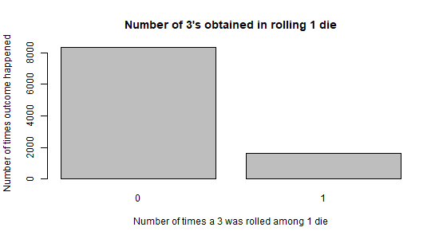
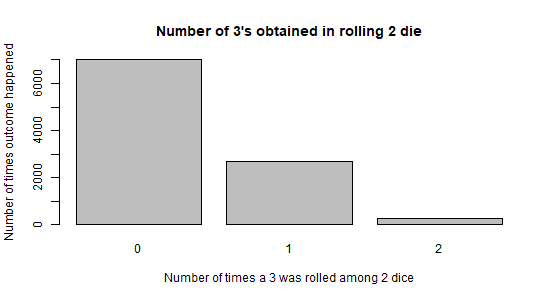
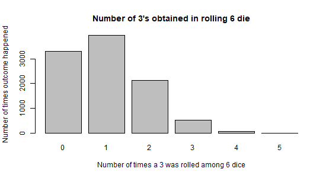
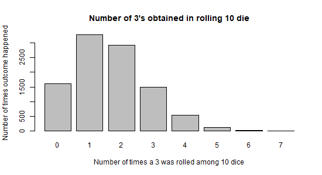
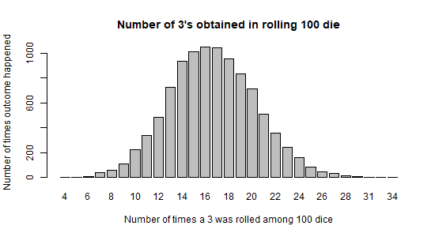

# Law-of-Large-Numbers
Exploring the law of large numbers in R with execution from Windows CMD (must be in administrator mode). This program will output 5 png files which show the barplots of 10,000 tests of rolling 1, 2, 6, 10, 100 dice and counting the number of times 3 is face-up.

To run the script
1) Download and install R
2) Open the directory for where R is installed, in my case it is "C:\Program Files\R\R-3.6.2\bin"
3) Open an instance of CMD in administrator mode (we'll be writing png files)
4) Type "Rscript <full file path of your R file>", eg "Rscript "C:\Users\Justin Cervantes\Desktop\Law-of-Large-Numbers\law_of_large_numbers.R"
  
Summary:
With lower numbers of dice, we expect a right skew because 1 dice has a 1/6 chance of rolling, so the ratio we’d expect is 1-5 3’s to non-threes. As more dice are cast however, we see the skew change to be zero-skewness because over more dice, the range stabalizes and the odds of getting no 3s are less. If you rolled 100 dice, the odds of none of them landing as a 3 are very few, and conversely the odds of having 100/100 dice is also extremely unlikely. The outcome we'd expect with more dice is to have the same probability of one dice rolling a 3, or 1/6. This is observed with a neutral graph with most tests at about 16 (1/6 * 100 dice).

